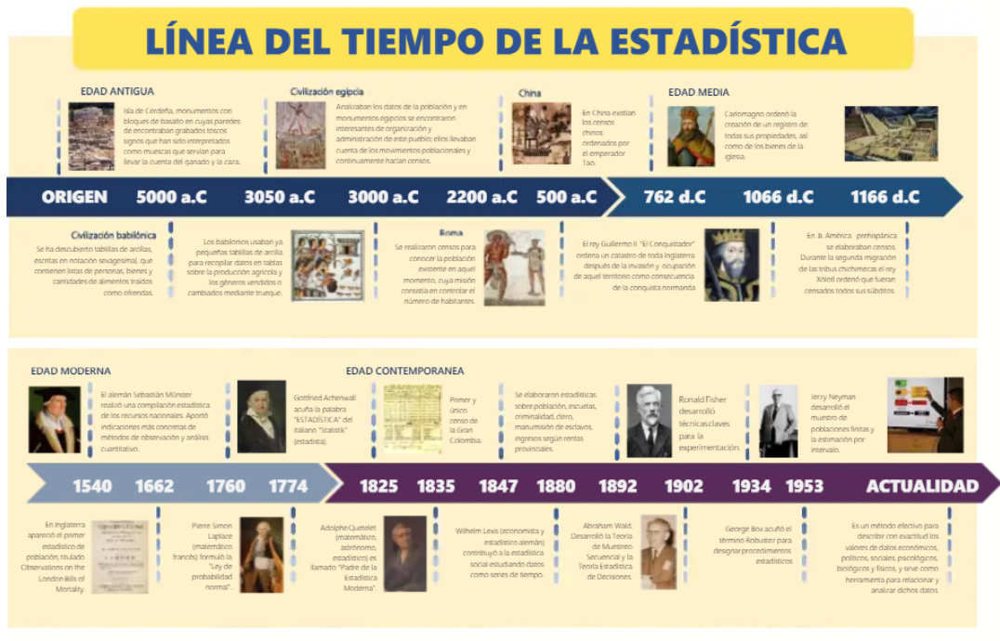

```{=html}
<div style="position: absolute; top: 60px; right: 75px;">
  
</div>
```

```{=html}
<style type="text/css">
  body {
    font-size: 130%;
    text-align: justify;
  }
</style>
```

# .Historia de la Estadística 

**Línea de tiempo de la historia de la estadística 3000 a.C. – 500 a.C.**

Civilizaciones antiguas En Egipto, Babilonia y China se realizaban censos y registros de población, tierras, cosechas e impuestos. La estadística nace como una herramienta de organización del Estado.

**27 a.C. – 476 d.C. Imperio Romano**

El Imperio Romano perfeccionó los censos para fines militares, fiscales y administrativos. Se usaba para saber cuántos habitantes había y qué recursos tenía el imperio.

**Edad Media**

La Iglesia y los reinos europeos registraban nacimientos, matrimonios y defunciones. Estos registros permitieron llevar un control más ordenado de la población.

**1662 John Graunt John Graunt**

analizó los registros de mortalidad de Londres. Publicó las primeras tablas de mortalidad. Es considerado uno de los primeros en usar datos para sacar conclusiones.

**Siglo XVII William Petty William Petty**

desarrolló la “aritmética política”. Aplicó números y cálculos al estudio del Estado y la economía.

**1654 Pascal y Fermat**

Blaise Pascal y Pierre de Fermat estudiaron problemas de juegos de azar. Sentaron las bases de la teoría de la probabilidad.

**1713 Jacob Bernoulli Jacob Bernoulli**

formuló la Ley de los Grandes Números. Demostró que, al aumentar los datos, los resultados se vuelven más precisos.

**1812 Pierre-Simon Laplace**

Pierre-Simon Laplace consolidó la teoría de probabilidades. Dio base matemática a la estadística moderna.

**Siglo XIX Adolphe Quetelet**

Adolphe Quetelet aplicó la estadística al estudio de la sociedad. Introdujo el concepto de “hombre promedio”.

**Siglo XIX Carl Friedrich Gauss**

Carl Friedrich Gauss desarrolló la distribución normal o “campana de Gauss”. Fundamental para el análisis estadístico.

**Finales del siglo XIX Francis Galton** Francis Galton introdujo los conceptos de correlación y regresión. Bases del análisis de relaciones entre variables.

**Siglo XX Karl Pearson Karl Pearson**

formalizó métodos estadísticos y el coeficiente de correlación. Impulsó la estadística matemática.

**Siglo XX Ronald Fisher**

Ronald Fisher revolucionó la estadística con el diseño experimental, la inferencia estadística y el análisis de varianza (ANOVA).

**Siglo XX Estadística moderna**

Se desarrollan pruebas de hipótesis, muestreo y estimación. La estadística se vuelve esencial en medicina, economía, psicología y ciencias sociales.

**Siglo XXI Big Data y ciencia de datos**

La estadística se integra con informática, inteligencia artificial y aprendizaje automático. Se usa para analizar grandes volúmenes de datos y apoyar decisiones en tiempo real.



# Conceptos fundamentales de la estadística

La estadística es una disciplina que permite recolectar, organizar, analizar e interpretar datos con el fin de comprender fenómenos, tomar decisiones y resolver problemas en distintos campos del conocimiento.

**ESTADISTICA**

La estadística es la ciencia que estudia los métodos para recopilar, clasificar, presentar, analizar e interpretar datos.

Su objetivo principal es transformar datos en información útil para la toma de decisiones.

**DATO**

Un dato es una representación numérica o cualitativa de una característica observada.

Es la unidad básica de información con la que trabaja la estadística.

**Ejemplos:**

-   Edad de una persona

-   Salario de un trabajador

-   Color de un vehículo

**Estadística descriptiva**

La **estadística descriptiva** es la rama de la estadística que se encarga de **recolectar, organizar, resumir y presentar datos** de manera clara y comprensible.\
Su objetivo principal es **describir las características de un conjunto de datos**, sin hacer generalizaciones ni predicciones fuera de ellos.

En otras palabras, esta rama **muestra lo que los datos dicen**, pero no intenta explicar por qué ocurre ni prever qué sucederá después.

**CARACTEERISTICA**

-   Ordena y clasifica datos.

-   Resume grandes volúmenes de información.

-   Presenta resultados de manera visual y numérica.

-   Facilita la comprensión de un fenómeno.

**ESTADISTICA INFERENCIAL**

La estadística inferencial es la rama de la estadística que permite sacar conclusiones, hacer estimaciones o tomar decisiones sobre una población, a partir del análisis de una muestra.

A diferencia de la descriptiva, esta no se limita a describir datos, sino que va más allá de ellos para formular conclusiones generales.

**Características**

-   Trabaja con muestras.

-   Generaliza resultados a una población.

-   Estima parámetros desconocidos.

-   Evalúa hipótesis.

-   Permite hacer predicciones.

**POBLACION**

La población es el conjunto total de elementos, individuos o casos que poseen una característica común y sobre los cuales se desea realizar un estudio.

**Ejemplo:**

Todos los estudiantes de una universidad.

**MUESTRA**

La muestra es un subconjunto de la población seleccionado para realizar el estudio.

Debe ser representativa para que los resultados puedan generalizarse.

**Ejemplo:** 100 estudiantes elegidos de una universidad de 2.000 alumnos.

**PARAMETRO**

Un parámetro es una medida numérica que describe una característica de la población.

**Ejemplos:**

-   Media poblacional

-   Proporción poblacional

**ESTADISTICO**

Un estadístico es una medida numérica calculada a partir de una muestra.

Se utiliza para estimar parámetros de la población.

**Ejemplos:**

-   Media muestral

-   Proporción muestral

**FRECUENCIA**

La frecuencia es el número de veces que se repite un dato o categoría dentro de un conjunto de observaciones.

**TIPOS DE FRECUENCIA**

-   **Frecuencia absoluta:** número de repeticiones.

-   **Frecuencia relativa:** proporción respecto al total.

-   **Frecuencia acumulada:** suma progresiva de frecuencias.

**DISTRIBUCION DE DATOS**

Es la forma en que se organizan o reparten los datos de una variable.

Permite identificar patrones, tendencias y comportamientos.

**MEDIDAS DE TENDENCIA CENTRAL**

Son valores que representan el centro de un conjunto de datos.

**PRINCIPALES MEDIDAS**

-   **Media:** promedio de los datos.

-   **Mediana:** valor central.

-   **Moda:** valor más frecuente.

**MEDIDAS DE DISPERSION**

Indican qué tan separados o dispersos están los datos respecto a un valor central.

**PRINCIPALES MEDIDAS**

**Rango**

-   **Varianza**

-   **Desviación estándar**

**PROBABILIDAD**

La probabilidad es la rama de la matemática que mide la posibilidad de que ocurra un evento.

Su valor va de 0 a 1.

**INFERENCIA ESTADISTICA**

Es el proceso mediante el cual se obtienen conclusiones sobre una población a partir del análisis de una muestra.

Permite:

-   Estimar valores

-   Probar hipótesis

-   Predecir resultados

# Variables

En estadística, las variables constituyen el núcleo del análisis, pues representan las características observables de los individuos que conforman una población o muestra. Toda investigación estadística parte de la necesidad de describir, comparar o explicar fenómenos, y ello solo es posible cuando dichas características se convierten en datos analizables. En este sentido, una variable es cualquier atributo, propiedad o característica que puede asumir diferentes valores entre los elementos de estudio.

**Concepto de variable**

Una variable estadística es una característica de los individuos de una población que puede observarse, medirse o clasificarse y que presenta variación de un individuo a otro. Su importancia radica en que permite traducir fenómenos de la realidad en información cuantificable o categorizable.

Por ejemplo, en un estudio sobre estudiantes universitarios, pueden considerarse variables como la edad, el sexo, el promedio académico, el nivel socioeconómico o el número de materias cursadas. Cada una de estas propiedades cambia entre individuos, razón por la cual se consideran variables.

**Conceptos fundamentales asociados**

Antes de clasificar las variables, es necesario comprender algunos conceptos básicos:

**Unidad estadística:** es el elemento individual sobre el cual se observa o mide una variable. También se conoce como individuo, caso o unidad de análisis.

**Población:** es el conjunto total de elementos o individuos que comparten una característica común y sobre los cuales se desea realizar el estudio.

**Muestra:** es un subconjunto representativo de la población seleccionado para realizar el análisis.

**Dato:** es el valor específico que toma una variable en una unidad estadística determinada.

**Observación:** es el registro de una o varias variables en una unidad estadística.

**Clasificación de las variables según su naturaleza**

De acuerdo con la naturaleza de la información que representan, las variables se clasifican en cualitativas y cuantitativas.

**Variables cualitativas**

Son aquellas que describen cualidades, atributos o categorías y no expresan cantidades numéricas, sino características clasificatorias.

Ejemplos de variables cualitativas son el sexo, el estado civil, la nacionalidad, la religión o el nivel educativo.

Las variables cualitativas se subdividen en:

**Nominales:** presentan categorías sin orden lógico o jerárquico. Ejemplos: sexo, nacionalidad, tipo de sangre.

**Ordinales:** presentan categorías con un orden lógico o jerárquico, aunque sin distancias exactas entre ellas. Ejemplos: nivel educativo, nivel de satisfacción, estrato socioeconómico.

**Variables cuantitativas**

Son aquellas que representan cantidades y cuyos valores tienen significado numérico, permitiendo operaciones matemáticas.

Ejemplos de variables cuantitativas son la edad, el peso, la estatura, el ingreso mensual o el número de hijos.

Las variables cuantitativas se subdividen en:

**Discretas:** toman valores enteros y generalmente resultan de un conteo. Ejemplos: número de hijos, número de empleados, cantidad de libros.

**Continuas:** pueden tomar cualquier valor dentro de un intervalo y generalmente resultan de una medición. Ejemplos: peso, estatura, tiempo, temperatura.

**Clasificación de las variables según su escala de medición**

Además de clasificarse según su naturaleza, las variables también se clasifican de acuerdo con la escala en que son medidas. Esta clasificación determina el tipo de operaciones estadísticas que pueden realizarse.

**Escala nominal**

Agrupa elementos en categorías mutuamente excluyentes sin establecer orden entre ellas. Solo permite clasificar e identificar.

Ejemplos: sexo, estado civil, nacionalidad, tipo de sangre.

**Escala ordinal**

Permite clasificar y ordenar los datos, pero no medir con exactitud la distancia entre categorías.

Ejemplos: nivel educativo, satisfacción, rango militar, estrato socioeconómico.

**Escala de intervalo**

Presenta orden y distancias iguales entre valores, pero no posee un cero absoluto. Esto significa que el valor cero no representa ausencia total de la característica medida.

Ejemplos: temperatura en grados Celsius o Fahrenheit, fechas del calendario, coeficiente intelectual.

**Escala de razón**

Es la escala más completa, ya que posee orden, distancias iguales y un cero absoluto que indica ausencia real de la magnitud.

Ejemplos: edad, peso, ingreso, estatura, tiempo, número de hijos.

**Importancia de la clasificación de variables**

La correcta clasificación de una variable es fundamental en estadística, ya que de ello depende la elección de métodos de análisis, la construcción de tablas y gráficos, y la selección de medidas descriptivas e inferenciales adecuadas. Una clasificación errónea puede conducir a interpretaciones incorrectas y conclusiones inválidas.

En consecuencia, comprender qué es una variable, cómo se clasifica y bajo qué escala se mide constituye uno de los fundamentos esenciales del análisis estadístico.\

**Análisis estadístico y clasificación de variables**

Desde una perspectiva estadística, las variables identificadas en el ejercicio representan atributos observables de la gestión pública susceptibles de clasificación y análisis. Su adecuada tipificación permite seleccionar correctamente los métodos de organización, representación y análisis de datos, garantizando rigor metodológico en la interpretación.

En términos generales, las variables del conjunto analizado se distribuyen en cuatro grandes categorías: **nominales, ordinales, discretas y continuas**. Esta clasificación responde a la naturaleza de los datos y al tipo de medición que permiten. Las variables nominales predominan en aquellos casos donde solo interesa identificar categorías sin jerarquía; las ordinales aparecen cuando existe una gradación lógica entre niveles; las discretas representan conteos exactos; y las continuas corresponden a magnitudes medibles con valores fraccionarios.

A nivel analítico, se observa una fuerte presencia de variables **cualitativas nominales** asociadas a clasificación institucional, administrativa y documental, tales como categoría de proyecto, sector gubernamental o tipo de contrato. Estas variables cumplen una función descriptiva y organizativa dentro del análisis estadístico, permitiendo segmentar observaciones sin establecer relaciones de magnitud.

Por su parte, las variables **ordinales** reflejan niveles de percepción, jerarquía o intensidad, como calidad del servicio público, complejidad de los trámites o grado de satisfacción ciudadana. Estas variables son especialmente útiles en estudios sociales y administrativos, dado que permiten establecer comparaciones jerárquicas sin asumir distancias exactas entre categorías.

Las variables **cuantitativas discretas** corresponden principalmente a conteos administrativos, como número de empleados, auditorías, sanciones o reuniones realizadas. Este tipo de variable es fundamental para el análisis de frecuencia y productividad institucional, ya que permite cuantificar eventos concretos en números enteros.

Finalmente, las variables **cuantitativas continuas** agrupan indicadores económicos, financieros, temporales y de desempeño, como tasa de desempleo, crecimiento económico, presupuesto anual o tiempo promedio de respuesta. Estas variables permiten un análisis más profundo mediante medidas de tendencia central, dispersión y correlación, siendo esenciales para estudios de eficiencia, gestión y evaluación pública.

En conjunto, la estructura del instrumento presenta una adecuada diversidad de variables, lo cual enriquece el análisis estadístico al integrar dimensiones cualitativas y cuantitativas del fenómeno administrativo. Esta combinación favorece una lectura integral de la realidad institucional, permitiendo describir, comparar y evaluar el comportamiento de la gestión pública desde múltiples perspectivas.

## **Tabla de clasificación de variables**

| Variable | Naturaleza | Clasificación | Justificación |
|----------------------------------------------------------------------------------------------------------------------------------------------------------------------------------|-----------------------------------------------------------------------|------------------------------------------------------------------------------|------------------------------------------------------------------------------------------------------------------------------------------------------------------------------------------------------------------------------------------------------------------------------------|
| Calidad del servicio público | Cualitativa | Ordinal | Presenta categorías con orden jerárquico (deficiente a excelente). |
| Cantidad de energía consumida (MW) | Cuantitativa | Continua | Magnitud medible que admite valores decimales. |
| Cantidad de recursos naturales (toneladas) | Cuantitativa | Continua | Variable de medición continua expresada en magnitud física. |
| Categoría de proyecto | Cualitativa | Nominal | Clasifica tipos de proyecto sin jerarquía. |
| Clasificación de entidad pública | Cualitativa | Nominal | Identifica categorías institucionales sin orden lógico. |
| Complejidad de los trámites | Cualitativa | Ordinal | Expresa niveles ordenados de complejidad. |
| Crecimiento económico anual (%) | Cuantitativa | Continua | Indicador porcentual con valores decimales. |
| Departamento de trabajo | Cualitativa | Nominal | Clasificación administrativa sin jerarquía. |
| Gastos operativos mensuales | Cuantitativa | Continua | Medición monetaria susceptible de decimales. |
| Grado de cumplimiento de regulaciones | Cualitativa | Ordinal | Presenta niveles progresivos de cumplimiento. |
| Índice de pobreza (%) | Cuantitativa | Continua | Proporción porcentual continua. |
| Modalidad de adjudicación | Cualitativa | Nominal | Corresponde a categorías sin orden. |
| Número de empleados | Cuantitativa | Discreta | Conteo exacto de personas. |
| Número de auditorías internas | Cuantitativa | Discreta | Conteo entero de eventos administrativos. |
| Número de contratos adjudicados | Cuantitativa | Discreta | Recuento de actos administrativos. |
| Número de quejas recibidas | Cuantitativa | Discreta | Conteo de registros ciudadanos. |
| Porcentaje de cumplimiento de metas | Cuantitativa | Continua | Medición proporcional expresada en porcentaje. |
| Presupuesto anual asignado | Cuantitativa | Continua | Variable monetaria medible. |
| Prioridad de los proyectos | Cualitativa | Ordinal | Presenta jerarquía entre niveles de prioridad. |
| Régimen de seguridad social | Cualitativa | Nominal | Clasifica categorías sin jerarquía. |
| Salario promedio de empleados | Cuantitativa | Continua | Medición monetaria continua. |
| Sector gubernamental | Cualitativa | Nominal | Clasificación institucional sin orden. |
| Tasa de desempleo (%) | Cuantitativa | Continua | Indicador porcentual continuo. |
| Tiempo promedio de respuesta (días) | Cuantitativa | Continua | Medición temporal susceptible de decimales. |
| Tipo de contrato | Cualitativa | Nominal | Categorías administrativas sin jerarquía. |
| Tipo de servicio público | Cualitativa | Nominal | Clasificación funcional sin orden lógico. |
